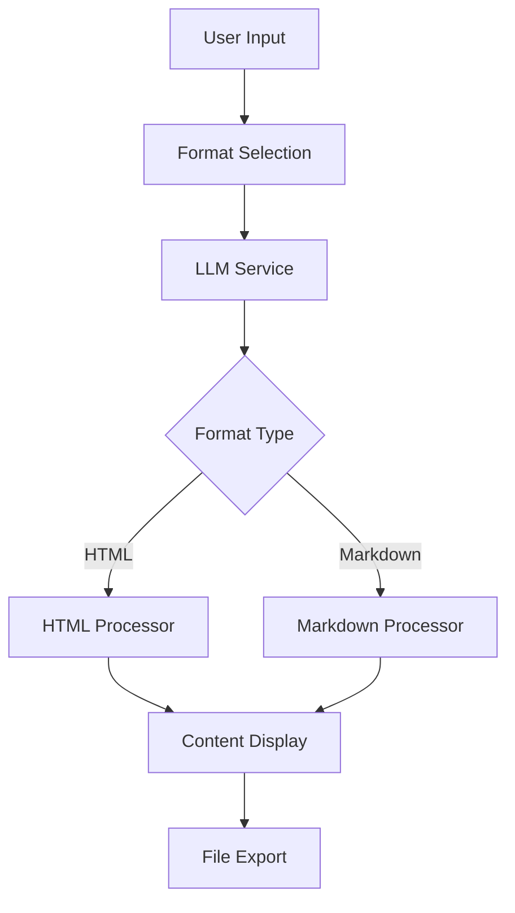

# Design Document

## Overview

This design document outlines the implementation of Markdown format support for the TeeZeeNator application. The feature will extend the existing technical specification generation system to support both Confluence Storage Format (HTML) and Markdown output formats, with Markdown as the preferred default.

The design maintains backward compatibility with the existing Confluence format while introducing a new format selection mechanism and specialized processing for Markdown content. The system will include format-specific prompt engineering for the LLM to ensure proper output formatting with required escape markers.

## Architecture

### Current Architecture Analysis

The current system follows this flow:
1. User inputs requirements through `MainScreen`
2. `LLMService` generates content using format-specific system prompts
3. `HtmlProcessor` extracts and cleans the generated content
4. Content is displayed in `ResultPanel` and can be saved via `FileService`

### Proposed Architecture Changes

The enhanced architecture will introduce:

1. **Format Selection Layer**: New UI component for format selection
2. **Format-Specific Processing**: Separate processors for HTML and Markdown
3. **Enhanced LLM Service**: Format-aware prompt generation
4. **Unified Content Pipeline**: Common interface for both formats



## Components and Interfaces

### 1. Format Selection Component

**Location**: `lib/widgets/main_screen/format_selector.dart`

```dart
class FormatSelector extends StatefulWidget {
  final OutputFormat selectedFormat;
  final ValueChanged<OutputFormat> onFormatChanged;
  
  const FormatSelector({
    required this.selectedFormat,
    required this.onFormatChanged,
  });
}

enum OutputFormat {
  markdown('Markdown', 'md', true),  // preferred default
  confluence('Confluence Storage Format', 'html', false);
  
  const OutputFormat(this.displayName, this.fileExtension, this.isDefault);
  final String displayName;
  final String fileExtension;
  final bool isDefault;
}
```

### 2. Enhanced LLM Service

**Location**: `lib/services/llm_service.dart` (modified)

The `LLMService` will be extended with format-aware methods:

```dart
class LLMService extends ChangeNotifier {
  // New method for format-specific generation
  Future<String> generateTZ({
    required String rawRequirements,
    String? changes,
    String? templateContent,
    required OutputFormat format,  // New parameter
  });
  
  // Format-specific prompt builders
  String _buildMarkdownSystemPrompt(String? templateContent);
  String _buildConfluenceSystemPrompt(String? templateContent);
}
```

### 3. Content Processors

**Base Interface**: `lib/widgets/main_screen/content_processor.dart`

```dart
abstract class ContentProcessor {
  String extractContent(String rawAiResponse);
  String getFileExtension();
  String getContentType();
}
```

**HTML Processor**: `lib/widgets/main_screen/html_processor.dart` (existing, enhanced)
**Markdown Processor**: `lib/widgets/main_screen/markdown_processor.dart` (new)

```dart
class MarkdownProcessor extends ContentProcessor {
  @override
  String extractContent(String rawAiResponse) {
    // Extract content between @@@START@@@ and @@@END@@@ markers
    // Validate Markdown syntax
    // Clean up any HTML remnants
  }
}
```

### 4. Enhanced App Configuration

**Location**: `lib/models/app_config.dart` (modified)

```dart
@HiveType(typeId: 10)
class AppConfig {
  // ... existing fields ...
  
  @HiveField(9)
  final OutputFormat preferredFormat; // New field for format preference
  
  AppConfig copyWith({
    // ... existing parameters ...
    OutputFormat? preferredFormat,
  });
}
```

### 5. Updated Main Screen

**Location**: `lib/screens/main_screen.dart` (modified)

The main screen will integrate the format selector and handle format-specific processing:

```dart
class _MainScreenState extends State<MainScreen> {
  OutputFormat _selectedFormat = OutputFormat.markdown; // Default to Markdown
  
  Future<void> _generateTZ() async {
    // ... existing validation ...
    
    final rawResponse = await llmService.generateTZ(
      rawRequirements: _rawRequirementsController.text,
      changes: _changesController.text.isNotEmpty ? _changesController.text : null,
      templateContent: activeTemplate?.content,
      format: _selectedFormat, // Pass selected format
    );
    
    // Use appropriate processor based on format
    final processor = _getProcessorForFormat(_selectedFormat);
    final extractedContent = processor.extractContent(rawResponse);
    
    // ... rest of the method ...
  }
}
```

## Data Models

### OutputFormat Enum

```dart
enum OutputFormat {
  markdown('Markdown', 'md', true),
  confluence('Confluence Storage Format', 'html', false);
  
  const OutputFormat(this.displayName, this.fileExtension, this.isDefault);
  final String displayName;
  final String fileExtension;
  final bool isDefault;
  
  static OutputFormat get defaultFormat => 
      values.firstWhere((format) => format.isDefault);
}
```

### Enhanced Generation History

```dart
@HiveType(typeId: 4)
class GenerationHistory {
  // ... existing fields ...
  
  @HiveField(6)
  final OutputFormat format; // Track format used for generation
  
  @HiveField(7)
  final String fileExtension; // Derived from format
}
```

## Error Handling

### Format-Specific Error Handling

1. **Markdown Processing Errors**:
   - Missing or malformed escape markers (@@@START@@@/@@@END@@@)
   - Invalid Markdown syntax
   - HTML content in Markdown output

2. **Content Extraction Errors**:
   - Empty content between markers
   - Malformed LLM responses
   - Unexpected content structure

3. **Format Selection Errors**:
   - Invalid format configuration
   - Missing format processors

### Error Recovery Strategies

1. **Graceful Degradation**: Fall back to raw LLM output if processing fails
2. **User Notification**: Clear error messages with suggested actions
3. **Logging**: Detailed error logging for debugging

## Testing Strategy

### Unit Tests

1. **Content Processors**:
   - Test extraction of content with various input formats
   - Test handling of malformed inputs
   - Test validation of output formats

2. **LLM Service**:
   - Test format-specific prompt generation
   - Test parameter validation
   - Mock LLM responses for different scenarios

3. **Format Selection**:
   - Test default format selection
   - Test format switching
   - Test persistence of format preferences

### Integration Tests

1. **End-to-End Generation**:
   - Test complete generation flow for both formats
   - Test format switching during session
   - Test file export with correct extensions

2. **Template Integration**:
   - Test template processing for both formats
   - Test template validation with different formats

### Widget Tests

1. **Format Selector Widget**:
   - Test UI rendering
   - Test user interactions
   - Test state management

2. **Main Screen Integration**:
   - Test format selector integration
   - Test content display for different formats

## Implementation Phases

### Phase 1: Core Infrastructure
- Implement `OutputFormat` enum
- Create base `ContentProcessor` interface
- Implement `MarkdownProcessor`
- Update `AppConfig` model

### Phase 2: LLM Integration
- Enhance `LLMService` with format-aware methods
- Implement Markdown-specific system prompts
- Add escape marker processing

### Phase 3: UI Integration
- Create `FormatSelector` widget
- Update `MainScreen` to handle format selection
- Integrate format-specific processing

### Phase 4: File Handling & Polish
- Update `FileService` for format-specific exports
- Enhance error handling and validation
- Add comprehensive testing

## Security Considerations

1. **Input Validation**: Validate format selection parameters
2. **Content Sanitization**: Ensure Markdown output doesn't contain malicious content
3. **File Export Security**: Validate file extensions and content types
4. **LLM Response Validation**: Verify escape markers and content structure

## Performance Considerations

1. **Processing Efficiency**: Optimize content extraction algorithms
2. **Memory Usage**: Efficient handling of large generated content
3. **UI Responsiveness**: Non-blocking format switching
4. **Caching**: Cache format preferences and processor instances